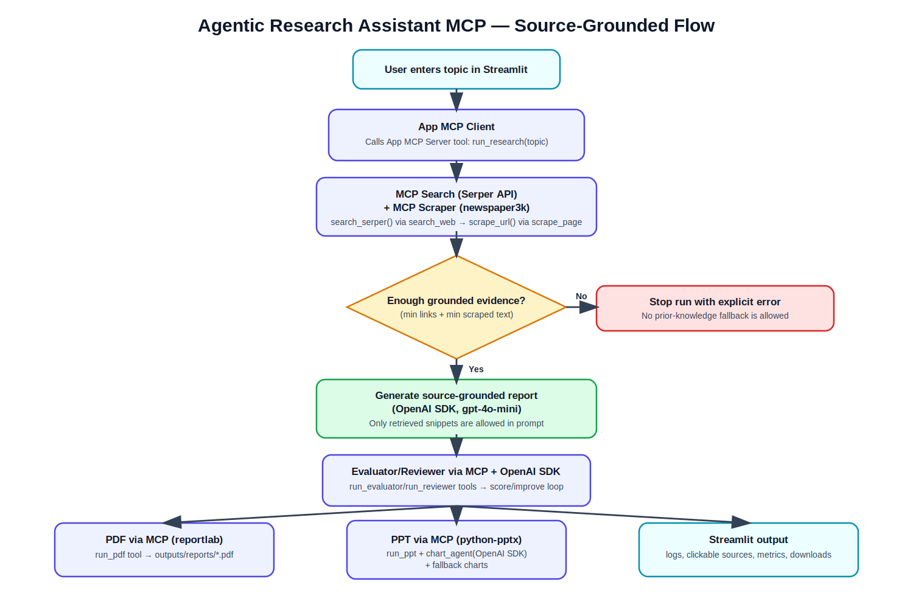
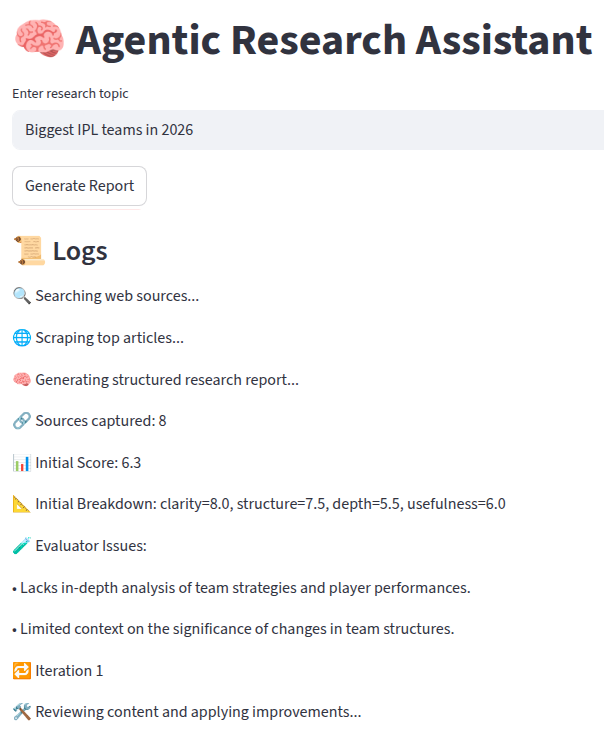
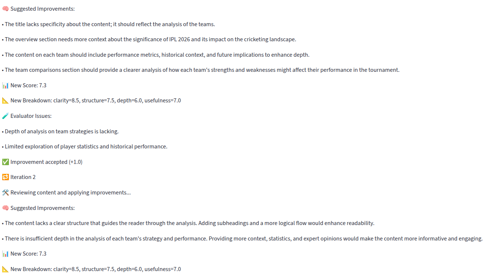
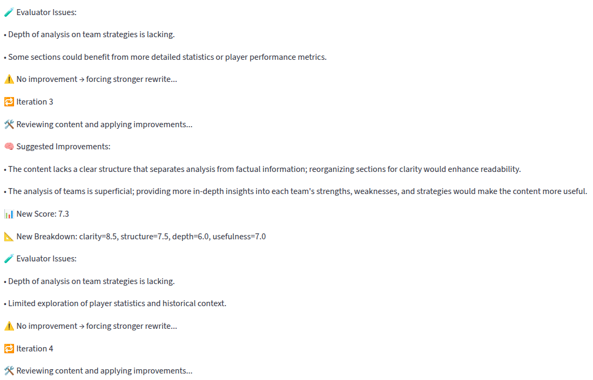
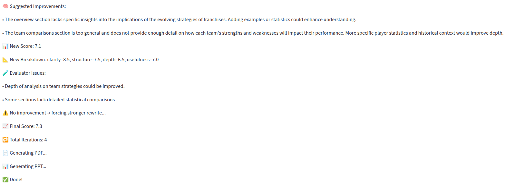
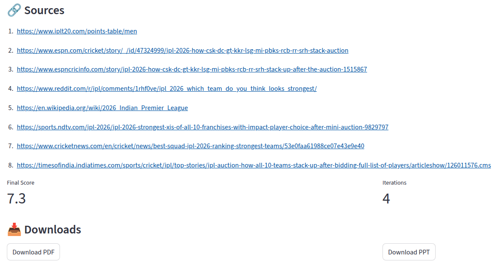

# Agentic Research Assistant using MCP and OpenAI Agents SDK

An end-to-end AI research workflow built with **Streamlit + OpenAI SDK + MCP-based tool orchestration**.

The app takes a research topic, gathers web sources, enforces source-grounded evidence, generates a structured report, iteratively improves quality through evaluator/reviewer loops, and exports final outputs as **PDF** and **PowerPoint**.

---

## What this project does

1. User enters a topic in Streamlit.
2. `research_agent` uses MCP Search (`search_web` → Serper API) + MCP Scraper (`scrape_page` → newspaper3k) to retrieve source evidence.
3. The app validates minimum evidence thresholds (links + scraped text).
4. OpenAI SDK (`gpt-4o-mini`) generates a structured JSON report (`title`, `sections`, `bullets`) using only retrieved snippets.
5. `evaluator_agent` (OpenAI SDK) scores report quality.
6. `reviewer_agent` (OpenAI SDK) rewrites the report based on weaknesses.
7. Loop runs until score improves enough or max iterations is reached.
8. Final report is exported to:
   - PDF (`reportlab`, via MCP `run_pdf`)
   - PPT (`python-pptx`, via MCP `run_ppt`, with chart slides planned by `chart_agent` using OpenAI SDK)
9. UI shows:
   - Logs
   - Score breakdown and iterations
   - Clickable source links
   - Download buttons for PDF/PPT

---

## Workflow (Flowchart)



---

## Tech stack

- **Python 3.10+**
- **Streamlit** (UI)
- **Model Context Protocol (MCP)** (`mcp` Python package, stdio transport)
- **OpenAI SDK** (LLM agents)
   - `research_agent` for report drafting
   - `evaluator_agent` for quality scoring
   - `reviewer_agent` for iterative rewriting
   - `chart_agent` (separate LLM step) for chart planning from report content
- **Serper API** (Google search)
- **newspaper3k** (web scraping)
- **reportlab** (PDF generation)
- **python-pptx** (PowerPoint generation)

---

## Project structure

```text
agentic_research_app_mcp/
├── app.py
├── .env
├── .gitignore
├── agents/
│   ├── research_agent.py
│   ├── evaluator_agent.py
│   ├── reviewer_agent.py
│   └── chart_agent.py
├── tools/
│   ├── app_mcp_server.py
│   ├── app_mcp_client.py
│   ├── search.py
│   ├── search_mcp_server.py
│   ├── search_mcp_client.py
│   ├── scraper.py
│   ├── scraper_mcp_server.py
│   ├── scraper_mcp_client.py
│   ├── pdf_generator.py
│   ├── ppt_generator.py
│   └── content_analysis.py
├── utils/
│   ├── logger.py
│   └── content_utils.py
├── outputs/
└── op/
    ├── op1.png
    ├── op2.png
    ├── op3.png
   ├── op4.png
   └── op5.png
```

---

## Setup

### 1) Clone and enter project

```bash
git clone <your-repo-url>
cd agentic_research_app_mcp
```

### 2) Install dependencies


```bash
pip install streamlit openai python-dotenv requests newspaper3k reportlab python-pptx mcp
```

### 3) Configure environment

Create `.env` in the project root:

```env
OPENAI_API_KEY=your_openai_key
SERPER_API_KEY=your_serper_key
```

### 4) Run app

```bash
streamlit run app.py
```

---

## Screenshots

### Main app view


### Agent loop + logs


### Metrics and source links


### Download outputs (PDF/PPT)


### Source-grounded run with captured links


---

## Notes

- Chart slides are generated from report content (LLM-planned with deterministic fallback).
- Charts are planned by an additional LLM (`chart_agent`) that extracts chart-worthy data from the final report before PPT generation.
- The report is **source-grounded only**. If retrieval evidence is insufficient, the run stops with an explicit error (no prior-knowledge fallback).
- Outputs are saved under `outputs/`.
- Sample generated files are available in `outputs/reports/` (PDF) and `outputs/slides/` (PPTX).

---

## MCP architecture

This copy routes the main app workflow via MCP tools over stdio:

- Orchestration server/client:
   - `tools/app_mcp_server.py`
   - `tools/app_mcp_client.py`
- Search MCP:
   - `tools/search_mcp_server.py`
   - `tools/search_mcp_client.py`
- Scraper MCP:
   - `tools/scraper_mcp_server.py`
   - `tools/scraper_mcp_client.py`

The Streamlit UI calls MCP client wrappers for:

- research
- reviewer
- evaluator
- PDF generation
- PPT generation

OpenAI SDK is still used by agent logic (`research_agent`, `reviewer_agent`, `evaluator_agent`, `chart_agent`), while tool access is MCP-mediated.

Additionally, the research stage enforces grounding constraints before report generation.

---

## Tool usage map (explicit)

- Search tool: `tools/search_mcp_server.py` → `tools/search.py` (`search_serper`, Serper API)
- Scraper tool: `tools/scraper_mcp_server.py` → `tools/scraper.py` (`scrape_url`, newspaper3k)
- Research generation: `agents/research_agent.py` (OpenAI SDK, `gpt-4o-mini`)
- Evaluation: `agents/evaluator_agent.py` (OpenAI SDK)
- Review rewrite: `agents/reviewer_agent.py` (OpenAI SDK)
- PDF export tool: `tools/pdf_generator.py` (reportlab)
- PPT export tool: `tools/ppt_generator.py` (python-pptx)
- Chart planning: `agents/chart_agent.py` (OpenAI SDK)
